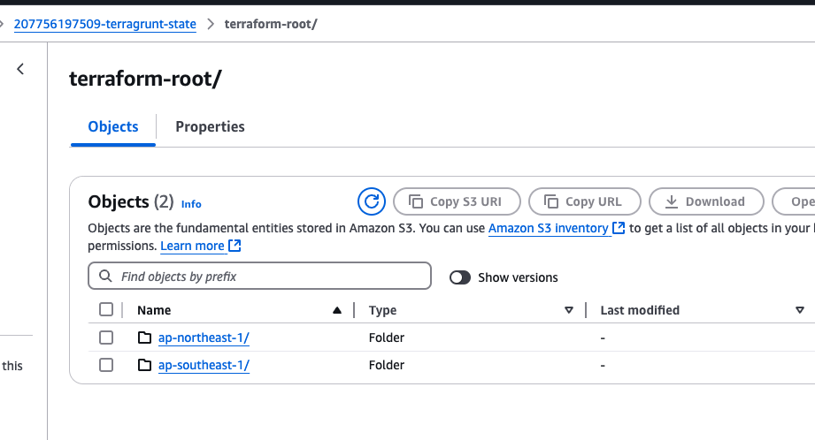
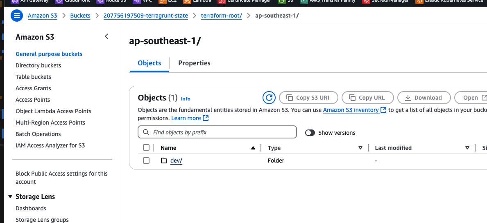
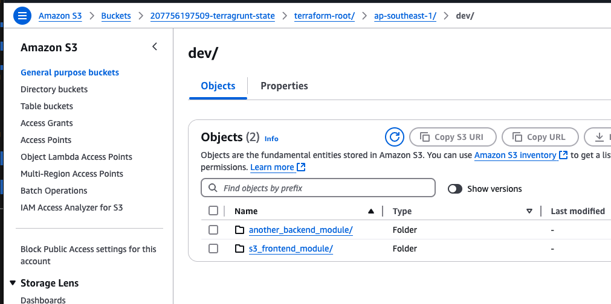
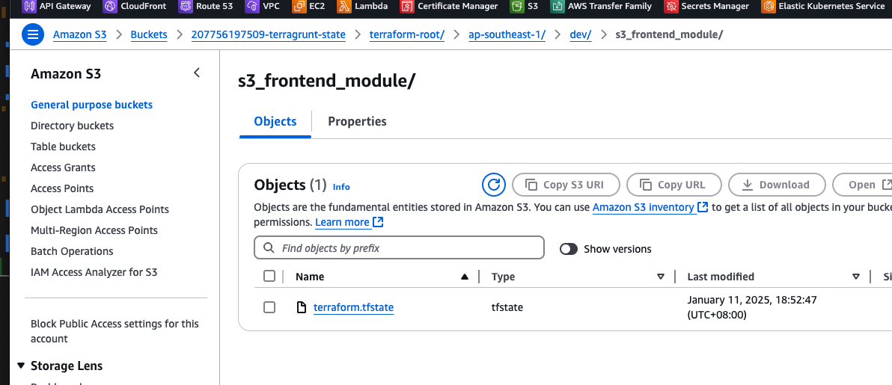

# Terragrunt POC

This terragrunt repo template focus on these few items

1. Terraform code must be DRY
2. The dry code must be able to deploy resources to any region as well
   - Take note of the `generate "provider"` block
   - Take note of the `remote_state, generate backend.tf` block
   - Take note of the `generate "required_provider"` block
     - this allow us to set different version for the provider in different env to test out new provider
3. The dry code must be able to deploy to different environment
   - with different environment variables
     - Notice that there is a file under `environments/ap-northeast-1/region-env.hcl`
       - the `region.hcl` file contains default variables for that specific region, regardless of env
     - Notice that there is a file under `environments/ap-northeast-1/dev/env.hcl`
       - the `env.hcl` file contains default variables for that specific environment, regardless of stacks
   - in the `root.hcl`, it will merge the variables from `environments/ap-northeast-1/region-env.hcl` and `environments/ap-northeast-1/dev/env.hcl` and apply it to the module. Allowing the module to reference the these variables easily.
4. Each module have their own state file.
   - This is to keep the state small & modular.
   - This allow the resource name to be reusable,
     - Example: `module "s3_wq_static_server_new"`
5. In this example, i used a fixed s3 bucket to store all the state files.
   - However, if you wish to have different s3 bucket to store the state files, u can change
     - `bucket = local.state_bucket_name` & `region = local.state_bucket_region`
       - NOTE: bucket names are unique in AWS.
6. Added dependency block.
   - Dependency block should be configured on the module level since the dependency code should be DRY.

# Statefiles

### another_backend_module

- s3://207756197509-terragrunt-state/environments/ap-southeast-1/dev/another_backend_module/terraform.tfstate

### s3_frontend_module

- s3://207756197509-terragrunt-state/environments/ap-southeast-1/dev/s3_frontend_module/terraform.tfstate

### Statefile are stored in S3 with such prefix /REGION/ENVIRONMENT/MODULE_NAME





Can see that states are in S3 bucket, in REGION folder and in ENVIRONMENT folder.

# How to run

```
# Ensure you have AWS Access & Secret Key in your pc before running
# Run aws configure to setup the key
aws configure

# Verify if you are accessible via aws cli
aws sts get-caller-identity --no-cli-pager

# To deploy single module
cd environments/ap-northeast-1/dev/another_backend_module
terragrunt init
terragrunt plan
terragrunt apply

# This will deploy/create all the modules in DEV environment in ap-northeast-1 region
# Group 1
# - Module ./dev/another_backend_module
# - Module ./dev/s3_frontend_module
cd environments/ap-northeast-1/dev
terragrunt run-all init
terragrunt run-all plan
terragrunt run-all apply

# This will deploy/create all the modules in AP-SOUTHEAST-1 region
# Group 1
# - Module ./dev/another_backend_module
# - Module ./dev/s3_frontend_module
cd environments/ap-southeast-1
terragrunt run-all init
terragrunt run-all plan
terragrunt run-all apply

# This will deploy/create all the modules in ALL regions
Group 1
# - Module ./ap-northeast-1/dev/another_backend_module
# - Module ./ap-northeast-1/dev/s3_frontend_module
# - Module ./ap-southeast-1/dev/another_backend_module
# - Module ./ap-southeast-1/dev/s3_frontend_module
cd environments
terragrunt run-all init
terragrunt run-all plan
terragrunt run-all apply
```

# Resource created


