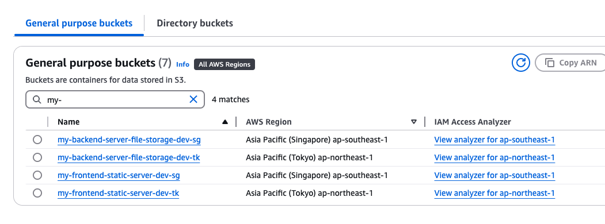

# Terragrunt POC

This terragrunt repo template focus on these few items

1. Terraform code must be DRY
2. The dry code must be able to deploy resources to any region as well
   - Take note of the `generate "provider"` block
3. The dry code must be able to deploy to different environment
   - with different environment variables
4. Each module should have their own state file. This is to keep the state small & modular.
   - This allow the resource name to be reusable,
   - Example: `module "s3_wq_static_server_new"`

# Statefiles

### another_backend_module

- s3://207756197509-terragrunt-state/terraform-root/ap-southeast-1/dev/another_backend_module/terraform.tfstate

### s3_frontend_module

- s3://207756197509-terragrunt-state/terraform-root/ap-southeast-1/dev/s3_frontend_module/terraform.tfstate

### Statefile are stored in S3 with such prefix /REGION/ENVIRONMENT/MODULE_NAME


Can see that states are in S3 bucket, in REGION folder and in ENVIRONMENT folder.

# How to run

```
# Ensure you have AWS Access & Secret Key in your pc before running
# Run aws configure to setup the key
aws configure

# Verify if you are accessible via aws cli
aws sts get-caller-identity --no-cli-pager

# This will deploy/create all the modules in DEV environment
# - Module ./dev/another_backend_module
# - Module ./dev/s3_frontend_module
cd terraform-root/ap-northeast-1/dev
terragrunt run-all init
terragrunt run-all plan
terragrunt run-all apply

# To deploy single module
cd terraform-root/ap-northeast-1/dev/another_backend_module
terragrunt init
terragrunt plan
terragrunt apply
```

# Resource created


